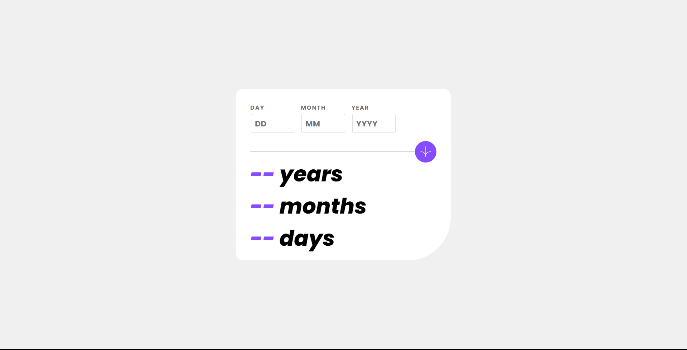
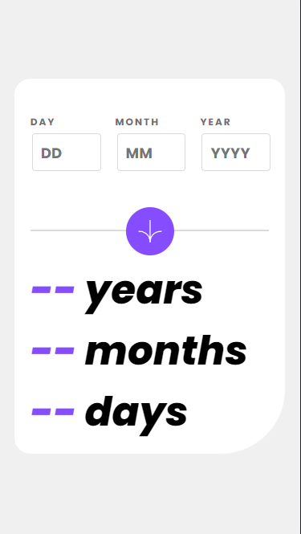

# Frontend Mentor - Gadgeter's Age calculator app solution

This is a solution to the [Age calculator app challenge on Frontend Mentor](https://www.frontendmentor.io/challenges/age-calculator-app-dF9DFFpj-Q). 
Frontend Mentor challenges help you improve your coding skills by building realistic projects. 

## Table of contents

- [Overview](#overview)
  - [The challenge](#the-challenge)
  - [Screenshot](#screenshots)
  - [Links](#links)
- [My process](#my-process)
  - [Built with](#built-with)
  - [What I learned](#what-i-learned)
- [Author](#author)

## Overview

### The challenge

Users should be able to:

- View an age in years, months, and days after submitting a valid date through the form
- Receive validation errors if:
  - Any field is empty when the form is submitted
  - The day number is not between 1-31
  - The month number is not between 1-12
  - The year is in the future
  - The date is invalid e.g. 31/04/1991 (there are 30 days in April)
- View the optimal layout for the interface depending on their device's screen size
- See hover and focus states for all interactive elements on the page

### Screenshots

#### Desktop Version


#### Mobile Version


### Links

- Solution URL: [GitHub Repository](https://github.com/EA-Gadgeter/age-calculator-app)
- [Live Solution URL](https://ea-gadgeter.github.io/age-calculator-app/)

## My process

### Built with

- Semantic HTML5 markup
- Vite
- SASS/SCSS
- Mobile-first workflow
- Vanilla JS / DOM Manipulation

### What I learned

This challenge really helped me to practice and learn about constraint API for validating forms.
Also taught me how to manage dates correctly in JavaScript.

This is how I validate that a date is... valid:
```js
const date = new Date(`${yearInput.value}-${monthInput.value}-${dayInput.value}`);
// Need to use UTC for avoiding TimeZone to subtract and hour, because time isn't specified in Date constructor
// if we don't use UTC, date may have one less day
const year = date.getUTCFullYear();
const month = date.getUTCMonth() + 1; // JavaScript´s months are 0-based
const day = date.getUTCDate();

let isValid = true;

/* 
    Above, if we pass a no-existing data like "2023-04-31"
    Date constructor will transform it to the next valid date,
    that is to say, ANOTHER date, so if the input values are not
    equal to the JS date, then the submitted inputs are invalid.
*/
const isValidDate = year == yearInput.value && month == monthInput.value && day == dayInput.value;

if(!isValidDate) {
  dayInputMessage.textContent = messages.validDate;
  dayInputMessage.classList.remove("hidden");

  // Based in the design, we only show the message in the day input,
  // so we hide other inputs messages
  monthInputMessage.classList.add("hidden");
  yearInputMessage.classList.add("hidden");

  dayInput.classList.add("invalid-input");
  dayInputLabel.classList.add("invalid-input");

  // ...but we still need to outline the other inputs
  monthInput.classList.add("invalid-input");
  monthInputLabel.classList.add("invalid-input");

  yearInput.classList.add("invalid-input");
  yearInputLabel.classList.add("invalid-input");

  isValid = false;

  yearResult.textContent = "--";
  monthResult.textContent = "--";
  dayResult.textContent = '--';
}

return isValid;
```

This is how calculate I calculate the day:
```js
// Creating date from user input, and today's date
const userBirth = new Date(`${yearInput.value}-${monthInput.value}-${dayInput.value}`);
const todayDate = new Date();

/* No need of adding +1 to the month later is necessary, above JS already indexes
the months, so when making the subtraction below, the quantity of months is correctly
calculated */
let years = todayDate.getFullYear() - userBirth.getUTCFullYear();
let months = todayDate.getMonth() - userBirth.getUTCMonth();
let days = todayDate.getDate() - userBirth.getUTCDate();

// There are a few days left before we reach the birthday day,
// so we decrease the months in one, we need to get the number of the days of the
// previous month, and add it to get the correct amount of days
if (days < 0) {
    months--;
    const daysPreviousMonth = new Date(todayDate.getFullYear(), todayDate.getMonth(), 0).getDate();
    days += daysPreviousMonth;
}

// We haven't completed year for the next birthday, so we decrease years in 1, and add 12 to months,
// so they aren't negative
if (months < 0) {
    years--;
    months += 12;
}

yearResult.textContent = years;
monthResult.textContent = months;
dayResult.textContent = days;
```

**Check my GitHub repository of the challenge to get full context of the code.**

## Author

- Website - [Gadgeter](https://ea-gadgeter.github.io/Web-Portafolio)
- Frontend Mentor - [@EA-Gadgeter](https://www.frontendmentor.io/profile/EA-Gadgeter)
